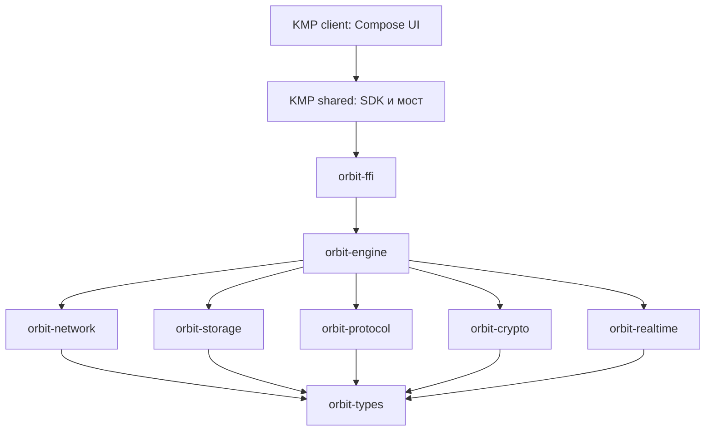
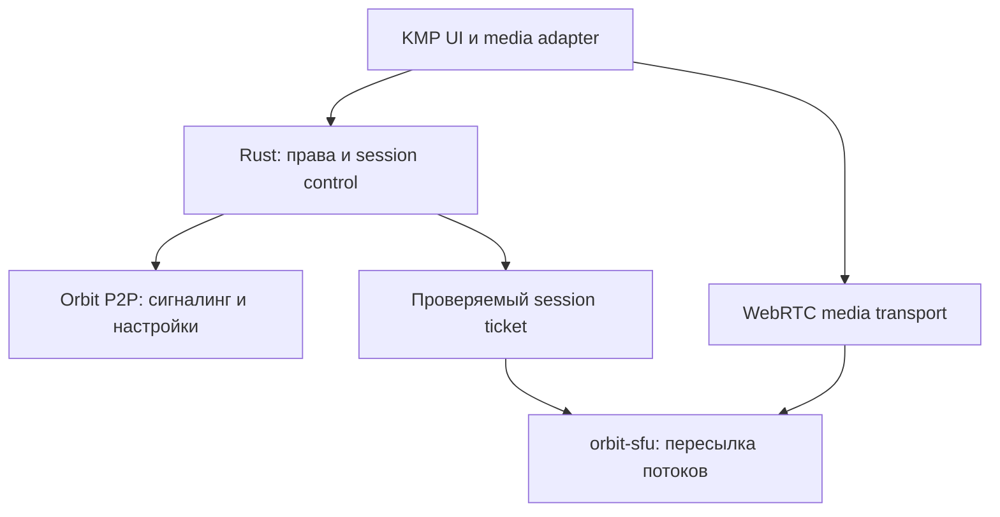

# Orbit: Rust-ядро, мосты и клиенты на Kotlin Multiplatform

Дата: 1 октября 2026. Редакция 2 — после архитектурного ревью. Статус: уточнённый проект; реализация и испытания ещё не выполнены.

Основание: `fighxy/orbit`, ветка `main`, commit `8125a75264bc61310d6c7d29508dc035f1544505`. Согласованные решения: собственный протокол Orbit; Rust для ядра; Kotlin Multiplatform для мостов и клиентов. Функциональный охват: голосовые комнаты как в Discord, каналы как в Telegram, голосовые сообщения, видеокружки и вложения. Compose Multiplatform предлагается как общий UI.

## 0. Вывод ревью и границы решений

Rust-ядро и KMP-клиенты сохраняются. Карта Holepunch описывает охват функций; она не является очередью обязательного переписывания библиотек. Целевые crates ниже не требуется создавать до первого работающего сценария.

Для старта достаточно `crates/orbit-core/` с внутренними модулями и `crates/orbit-ffi/`. В первую техническую итерацию входят KMP UI, C ABI/JNI, защищённое локальное состояние, сообщение между двумя устройствами и отдельный эксперимент голосовой комнаты. Голос, iOS lifecycle и E2EE больше не отложены до конца разработки.

Iroh, OpenMLS и str0m — кандидаты, требующие испытаний. Для голоса сначала использовать готовый SFU как контрольный вариант; собственный Rust-SFU — самостоятельный следующий проект. Это рекомендация ревью, а не утверждение, что медиастек уже выбран или подключён.

Начальная модель — P2P для обмена данными с доступной инфраструктурой доставки и голоса. Возможность self-hosting заложена; отсутствие всех постоянно доступных узлов не обещается. ACL комнаты, шифрование, восстановление истории и свежесть авторизации SFU должны получить конкретные контракты до реализации приватных групп.

## 1. Что есть сейчас

В репозитории есть `shared/` с моделями Identity, Message, Room, интерфейсами хранилища и платформенными заготовками. Реализованного P2P-движка, Rust workspace, приложений и JS-моста в просмотренном дереве нет. iOS KeyStore содержит TODO.

Документы противоречат друг другу: README описывает использование JS-зависимостей через мост, а `docs/holepunch-map.md` — собственную реализацию на Kotlin. `package.json` перечисляет зависимости, но не доказывает, что они используются. Поэтому работа будет созданием ядра на раннем каркасе, а не переносом готового мессенджера.

Текущий `Identity` содержит seedPhrase, а `Message.sender` и `Room.members` используют этот тип. Перед реальной сериализацией нужно отделить публичную идентичность от секретов: DTO отправителя и участника никогда не должны включать seedPhrase.

Повторная проверка `main` подтвердила тот же commit. Дополнительные конкретные проблемы каркаса: desktop KeyStore сохраняет seed в Base64; desktop LocalDatabase пишет длину payload вместо его содержимого; Java API из desktopMain подключены также к Kotlin/Native targets. Android/iOS secure store содержат TODO. Сборка в рамках ревью не запускалась; эти наблюдения основаны на исходниках и конфигурации и не являются отчётом о запуске тестов.

## 2. Главные решения

1. Один репозиторий `orbit`, один Cargo workspace в корне, Gradle-проект для KMP рядом.
2. Rust владеет протоколом, P2P-сессиями, проверкой подписей, журналом, репликацией, криптографическим состоянием и правилами комнаты.
3. KMP владеет SDK-фасадом, UI, ViewModel, навигацией, адаптацией жизненного цикла и доступом к службам ОС.
4. Общий UI — Compose Multiplatform. Android, iOS, Windows, Linux и macOS используют общие экраны и состояние, с платформенными настройками поведения.
5. Мост написан на KMP: JNI для Android/JVM desktop; C ABI + Kotlin/Native cinterop для iOS. Все мосты вызывают один и тот же Rust-движок.
6. Собственный протокол имеет имя `orbit/1`. Совместимость с HyperDHT, Hypercore, Autobase и приложениями Holepunch не обещается.
7. Начало — `orbit-core` и `orbit-ffi`. Семь базовых библиотек и `orbit-realtime` ниже — возможная последующая декомпозиция по проверенным границам.
8. Holepunch служит источником архитектурных идей. Уже существующие транспортные, криптографические и системные библиотеки используются повторно.

## 3. Директории в корне

Ниже целевая структура, а не список уже существующих файлов. `shared/` сохраняет текущее имя, чтобы не создавать ненужный переезд.

| Путь | Назначение |
|---|---|
| `Cargo.toml` | Rust workspace, общие зависимости и профили |
| `Cargo.lock` | Фиксация зависимостей для воспроизводимых сборок |
| `rust-toolchain.toml` | Зафиксированная проверенная версия Rust |
| `crates/` | Rust-библиотеки ядра |
| `shared/` | KMP SDK, DTO, мосты и платформенные адаптеры |
| `client/` | Общий UI на Compose Multiplatform |
| `apps/android/` | Android entry point, manifest, разрешения, упаковка |
| `apps/ios/` | iOS/Xcode host, entitlements, упаковка и запуск Compose UI |
| `apps/desktop/` | JVM entry point и упаковка Windows/Linux/macOS |
| `services/` | Отдельные исполняемые программы инфраструктуры |
| `protocol/` | Спецификация собственного протокола и тестовые векторы |
| `tests/` | Проверки между устройствами, процессами и языками |
| `fuzz/` | Fuzz targets для декодирования и проверки данных |
| `benches/` | Нагрузочные сценарии и замеры |
| `tools/` | Сборка, генерация ABI/JNI и тестовые программы |
| `deploy/` | Конфигурация relay/mailbox/push инфраструктуры |
| `docs/architecture/` | Описание слоёв и границ ответственности |
| `docs/adr/` | Решения с обоснованием и последствиями |
| `docs/migration/` | Карта Holepunch и план перехода |
| `docs/security/` | Модель угроз, работа с ключами и ограничения приватности |

Имена Rust crates и директорий: `orbit-network`, `orbit-storage`, с дефисом. Импорт Rust: `orbit_network`, с подчёркиванием. Внутренние модули: `snake_case`. Не использовать папки `misc`, `helpers`, `manager` без конкретной ответственности.

## 4. Rust-библиотеки

Начальная структура: `crates/orbit-core/src/{domain,identity,crypto,protocol,storage,network,sync,media,realtime}/` и `crates/orbit-ffi/src/{c_api,jni,handles,events}/`. Синтаксис с фигурными скобками обозначает список директорий; не создавать буквальную папку со скобками. Engine facade сначала находится в orbit-core. `services/orbit-node/` появляется при проверке offline delivery; несколько функций узла могут жить в одном процессе с разными capability.

Следующая таблица — целевая карта выделения crates. В начале соответствующие функции остаются модулями orbit-core; ссылки на orbit-engine и остальные будущие crates в карте Holepunch обозначают их целевых владельцев.

| Crate / директория | Внутренние модули | Ответственность |
|---|---|---|
| `crates/orbit-types/` | `ids`, `public_identity`, `errors`, `limits` | Строго типизированные ID и публичные значения; без IO и секретов |
| `crates/orbit-crypto/` | `keys`, `signatures`, `kdf`, `encryption`, `groups` | Использование готовых криптопримитивов, группы, управление секретным состоянием |
| `crates/orbit-protocol/` | `codec`, `envelope`, `handshake`, `sync`, `invite`, `delivery`, `version` | Каноническое кодирование, форматы сообщений, версии и ограничения |
| `crates/orbit-storage/` | `journal`, `merkle`, `registry`, `views`, `blobs`, `migrations` | Журналы, доказательства, локальные индексы, файлы и восстановление |
| `crates/orbit-network/` | `transport`, `discovery`, `sessions`, `streams`, `reconnect`, `relay` | Соединения, поиск адресов, каналы, переподключение, адаптер готового транспорта |
| `crates/orbit-engine/` | `identity`, `communities`, `rooms`, `channels`, `permissions`, `messaging`, `sync`, `invites`, `delivery`, `attachments`, `calls`, `lifecycle` | Оркестрация и правила мессенджера; публичный Rust API |
| `crates/orbit-realtime/` | `signaling`, `voice_rooms`, `participants`, `session`, `sfu`, `reconnect`, `stats` | Вводится для голосовых комнат: admission, состояние real-time сессий и контракт медиадвижка |
| `crates/orbit-ffi/` | `c_api`, `jni`, `handles`, `buffers`, `commands`, `events` | Узкая ABI-граница, владение памятью, перевод ошибок |

`orbit-engine` — точка сборки подсистем, а не папка для случайной логики. Его модули не должны реализовывать UDP, SQL или бинарные парсеры повторно.

В целевой декомпозиции нижние библиотеки зависят от `orbit-types`; протокол и storage не зависят от UI/FFI. Network передаёт ограниченные по размеру данные, engine соединяет network, storage, protocol и crypto. FFI сначала зависит от orbit-core, затем от выделенного engine. Циклические зависимости запрещены. Диаграмма показывает целевые функциональные границы, а не обязательное количество пакетов первого коммита.

## 5. Полная карта замены компонентов Holepunch

Это соответствие функций, а не обещание побайтового порта. Ни одна строка не означает готовую реализацию.

| Компонент Holepunch | Собственный эквивалент / путь | Решение |
|---|---|---|
| Hyperswarm | `orbit-network/src/discovery/`, `sessions/` | Поиск участников, лимиты соединений, reconnect; начать с адресов из приглашений |
| HyperDHT | `orbit-network/src/discovery/` | На первом этапе адресный lookup готового транспорта; собственную DHT рассматривать отдельно |
| libudx | `orbit-network/src/transport/` | Готовый Rust-транспорт; QUIC вместо переписывания надёжного UDP |
| secret-stream | `orbit-network/src/transport/` и `orbit-crypto/` | Защита транспорта готовой библиотекой; шифрование сообщений отдельно |
| compact-encoding | `orbit-protocol/src/codec/` | Собственный канонический формат и тестовые векторы |
| protomux | `orbit-network/src/streams/` | Каналы управления, репликации и файлов поверх потоков транспорта |
| hrpc | `orbit-protocol/` и `orbit-engine/` | Типизированные запросы, request ID, таймауты и отмена |
| hyperbeam | `orbit-network/src/sessions/` | Прямая сессия двух устройств; отдельный универсальный pipe не нужен для MVP |
| Hypercore | `orbit-storage/src/journal/`, `merkle/` | Логический журнал на пару scope/device; сначала подписанные события и диапазоны; Merkle proofs при доказанной необходимости |
| Corestore | `orbit-storage/src/registry/` | Открытие журналов, namespaces, владение storage, квоты |
| Hyperbee | `orbit-storage/src/views/` | Локальные индексы SQLite; восстанавливаются из доступной защищённой истории |
| HyperDB | `orbit-storage/src/views/`, `migrations/` | Типизированная локальная схема; синхронизировать события, а не SQL-файл |
| Autobase | `orbit-engine/src/rooms/`, `sync/` | Слияние причинных событий и детерминированное состояние; отдельная спецификация прав |
| Hyperblobs | `orbit-storage/src/blobs/` | Зашифрованные chunks, manifest, проверки целостности и resume |
| Hyperdrive | `orbit-engine/src/attachments/` | Метаданные вложений + blob storage; без полного распределённого POSIX FS |
| Localdrive | KMP `shared/.../platform/files/` | Выбор файла и доступ к sandbox ОС; содержимое обрабатывает Rust |
| mirror-drive | `orbit-engine/src/attachments/` | Планировщик загрузки, pin/cache/eviction; полноценный directory mirror позже |
| keet-identity-key | `orbit-crypto/src/keys/`, `kdf/` + engine `identity/` | Собственная версионированная схема аккаунта и устройств |
| keypear | `orbit-engine/src/identity/` + KMP `platform/securestore/` | Сертификаты устройств, отзыв и Keychain/Keystore/keyring |
| blind-pairing | `orbit-engine/src/invites/` | Приглашение capability, подтверждение, ограничения и срок действия |
| blind-pairing-core | `orbit-protocol/src/invite/` | Собственные состояния запрос/проверка/подтверждение |
| blind-peering | `orbit-engine/src/delivery/` | Хранение зашифрованных событий на постоянно доступном узле |
| blind-peer | `services/orbit-mailbox/` | Rust mailbox с TTL, квотами, capability и подтверждениями записи |
| blind-peer-muxer | `orbit-protocol/src/delivery/`, network `streams/` | Канал store-and-forward поверх общего транспорта |
| bare, bare-kit | Rust library + `orbit-ffi` + KMP SDK | JS runtime не требуется; его функции заменяются нативным ядром |
| bare-worker, bare-thread | Rust async runtime и ограниченные рабочие задачи | Существующие runtime/task primitives, без копии JS workers |
| libjs, libqjs, libjsc, libjerry, libmqjs | Отсутствуют в production ядре | JS-движки не нужны выбранной архитектуре |
| bare-fs | Rust storage и KMP OS adapters | Обычный доступ к файлам с учётом sandbox |
| bare-pack, bare-bundle | `tools/`, Gradle, Cargo | Нативная сборка и упаковка |
| pear-runtime | KMP lifecycle + платформенная упаковка | Без системы исполнения JS-приложений |
| pear, pear-install | `tools/`, `apps/`, CI и штатные установщики | Подписанные релизы; отдельная P2P-доставка desktop updates только позже |
| libsodium | Готовые криптографические зависимости | Не писать свою реализацию Ed25519/X25519/AEAD |
| libuv | Rust async runtime | Использовать существующий IO runtime |
| CMake | Cargo + Gradle; CMake только где требует сторонний native SDK | Не создавать новую систему сборки |

Карта покрывает компоненты, перечисленные в текущем `docs/holepunch-map.md` и README. Она не является аудитом всех транзитивных пакетов организации Holepunch.

## 6. Выбор сетевого основания

Рекомендуемый кандидат для первого прототипа — Iroh под адаптером `orbit-network`. Его исходный README описывает адресацию публичным ключом, QUIC, попытки прямого соединения и relay fallback. Есть отдельные blob/gossip библиотеки. Это основание для проверки, а не подтверждение совместимости с Holepunch.

Сначала проверить: Android arm64, iOS arm64 и simulator arm64, JVM desktop, смену Wi-Fi/мобильной сети, CGNAT, relay-only соединение, расход батареи и длительное reconnect. Фиксировать конкретную проверенную версию и настройки lookup/relay. Готовность на всех платформах нельзя объявлять по одному успешному desktop demo.

Для репликации и вложений выбрать один транспорт. WebRTC для живого голоса — отдельный необходимый медиатранспорт и этому правилу не противоречит. Если Iroh не проходит требования, альтернативный data adapter проектировать после конкретного результата испытаний. Не переписывать QUIC или алгоритм congestion control ради собственного бренда.

Topic-based discovery не появляется автоматически от использования Iroh. Для MVP адреса, network key и bootstrap информация приходят в приглашении. Для большой сети отдельно понадобятся адресный lookup и/или discovery overlay. Presence — приблизительная доступность устройств, а не гарантированный глобальный online.

Существующий Rust Hypercore от datrs описан авторами как ограниченный порт с целью совместимости дискового формата LTS. Его можно изучить, но выбранный собственный протокол не требует зависимости от него.

## 7. Мосты на KMP

KMP commonMain содержит интерфейс `NativeEngine`, `OrbitClient`, публичные DTO и Flow событий. Криптографические и сетевые реализации в Kotlin не дублируются.

| KMP source set / директория | Реализация |
|---|---|
| `shared/src/commonMain/kotlin/com/orbit/sdk/api/` | `OrbitClient`, `CommunityApi`, `RoomApi`, `ChannelApi`, `MessageApi`, `AttachmentApi`, `VoiceRoomApi` |
| `shared/src/commonMain/kotlin/com/orbit/sdk/model/` | Публичные DTO, статусы и ошибки |
| `shared/src/commonMain/kotlin/com/orbit/sdk/bridge/` | `NativeEngine`, команды, корреляция результатов, события |
| `shared/src/commonMain/kotlin/com/orbit/sdk/platform/` | Контракты secure store, files, lifecycle, notifications, media |
| `shared/src/commonMain/kotlin/com/orbit/sdk/lifecycle/` | foreground/background, сеть, запуск и закрытие |
| `shared/src/androidMain/.../bridge/` | Kotlin JNI adapter и загрузка `.so` |
| `shared/src/iosMain/.../bridge/` | Kotlin/Native cinterop, вызовы C ABI |
| `shared/src/jvmMain/.../bridge/` | Kotlin JNI adapter для Windows/Linux/macOS |
| `shared/src/iosMain/.../platform/` | Keychain и службы Apple через Kotlin/Native |
| `shared/src/androidMain/.../platform/` | Keystore и Android APIs |
| `shared/src/jvmMain/.../platform/` | Desktop keyring, file picker, уведомления |
| `shared/src/nativeInterop/cinterop/orbit.def` | Описание C-заголовка для Kotlin/Native |
| `shared/src/commonTest/` | Контракт SDK, отмена операций, восстановление подписки |

`...` в таблице обозначает соответствующий package path `kotlin/com/orbit/sdk/`; реальная директория должна содержать полный путь.

Desktop UI предлагается на JVM Compose для всех трёх ОС. Поэтому `desktopMain` при миграции можно превратить в JVM-only shared source set или перенести его содержимое в jvmMain. Существующие mingw/linux/macos Kotlin Native targets нужны только при отдельном потребителе SDK; не подключать JVM/JNI actual к Native targets.

UniFFI поддерживает Kotlin и Swift bindings, но это не доказательство пригодности одного generated Kotlin binding для commonMain и Kotlin/Native. При выбранных KMP-мостах базовый вариант — собственный узкий C ABI и JNI adapter. Дополнительный генератор допустим после проверки всех нужных targets; второй параллельный публичный SDK не нужен.

### ABI-контракт

Проектировать минимальные операции: `create`, `submit_command`, `wait_events`, `cancel`, `close`, `free_buffer`, `abi_version`. Это названия будущего контракта, не существующие функции. wait_events выполняется на выделенном worker вне UI thread, имеет timeout/cancel и просыпается при новых данных или close; периодический частый polling не является основным режимом.

- Один runtime на engine, без нового runtime на каждый FFI-вызов.
- Engine handle — проверяемый opaque handle с защитой от повторного использования после close.
- Команды возвращают request ID; KMP превращает завершение в suspend-результат и поток событий в Flow.
- Вывод событий пакетами через ограниченную очередь и ожидание уведомления. Close гарантированно будит ожидающий worker; тестируется отсутствие потерянного пробуждения. Event sequence и запрос snapshot позволяют восстановить состояние UI после переполнения или новой подписки.
- Очереди имеют лимиты. Прогресс загрузки можно объединять; потеря критических событий требует resync, а не молчаливого успеха.
- У буфера есть один владелец и одна функция освобождения. Kotlin не сохраняет указатель после free.
- Паника Rust не пересекает FFI; ошибки переводятся в типизированные коды. Abort-профиль не считать механизмом обработки ошибок.
- Cancel и close проверяются при гонках с завершением задачи. Закрытие не оставляет callbacks/threads с доступом к освобождённой памяти.
- Секреты не попадают в обычные DTO, Debug, exception messages, tracing или командные журналы.
- Вложения передаются через разрешённый файл/stream handle; крупный файл не сериализуется целиком в JNI byte array.
- Генерировать `orbit.h` и JNI declarations из проверенного контракта; генерируемые файлы не редактировать вручную.

## 8. Клиенты на KMP

| Путь внутри `client/src/commonMain/kotlin/com/orbit/client/` | Назначение |
|---|---|
| `app/` | Compose root и связывание зависимостей |
| `navigation/` | Общая навигация и обработка deep links |
| `designsystem/` | Темы, типографика, базовые компоненты |
| `features/onboarding/` | Создание/восстановление идентичности |
| `features/chatlist/` | Список комнат |
| `features/chat/` | Сообщения, composer, история |
| `features/rooms/` | Участники, права и приглашения |
| `features/communities/` | Сообщества, список разделов и роли |
| `features/channels/` | Публикации, подписки, управление каналом и обсуждения |
| `features/attachments/` | Просмотр и загрузка вложений |
| `features/calls/` | UI и управление состоянием звонка |
| `features/voicerooms/` | Постоянные голосовые комнаты, участники, mute/deafen, push-to-talk |
| `features/voicenotes/` | Запись, waveform и воспроизведение голосовых сообщений |
| `features/videonotes/` | Запись видеокружка, preview и круглая маска отображения |
| `features/settings/` | Настройки и управление устройствами |
| `features/networkstatus/` | Direct/relay, offline и состояние доставки |

В feature держать `screen`, `state`, `viewmodel` и UI-компоненты. Не переносить туда transport/session/key logic. Android/iOS/desktop actuals используются для различий окна, input, разрешений и ОС.

iOS приложение по-прежнему требует Xcode host и штатную упаковку. Его задача — запуск KMP/Compose UI; отдельный SwiftUI-клиент и Swift-реализация моста в этом плане не нужны. Точная форма минимальной стартовой оболочки определяется сборкой Compose iOS.

## 9. Хранение, синхронизация и комнаты

### Разделить журнал и представление

Для первой версии журнал событий, outbox, crypto state и локальная история хранятся транзакционно в одной SQLite базе, которой владеет Rust. Индексы/списки сообщений — производные представления; сетевой ciphertext — только часть данных. Файлы вложений — отдельный blob store. Не синхронизировать файл SQLite между участниками и не вести независимые источники истины в Rust, Room и SwiftData.

После удаления старых ключей ratchet/MLS старый ciphertext может быть невозможно расшифровать заново. Поэтому локальное содержимое истории, защищённое шифрованием на устройстве, attachment keys и актуальное crypto state не считать выбрасываемым cache. Индексы восстанавливаются из доступной защищённой истории; восстановление истории из сетевого журнала зависит от наличия нужного ключевого материала и выбранной политики backup.

При отправке атомарно сохраняются новое crypto state, окончательный ciphertext и outbox; сеть отправляет только после durable commit. Retry передаёт тот же сохранённый envelope. При получении crypto state, dedup marker и локальный результат сохраняются согласованно до application ACK. Memory-only изменение ratchet не должно пережить неудавшийся DB commit; adapter должен уметь откатить/перезагрузить состояние. Это проверяется fault injection, а не только happy-path тестом.

Внешние blobs публикуются после durable записи файла и manifest; осиротевшие файлы убираются безопасным GC. Retention history, backup и GC задаются отдельно от cache eviction. Прежнее обещание полного восстановления из одного append-only журнала исключено.

Вариант пути данных: `orbit-data/accounts/<account-id>/` с `blobs/`, `cache/`, `state.sqlite`. Логические журналы на первом этапе находятся в state.sqlite. Это внутри разрешённой директории приложения, не в checkout. У аккаунта есть device ID и отдельные ключи; приложения блокируют одновременную запись несколькими engine в одно хранилище.

### События и репликация

Логический журнал разделяется по паре `(scope_id, device_id)`, где scope — чат, канал или управляющий поток сообщества. Это предотвращает обязательную репликацию истории чужих комнат и разрывы из-за недоступных соседних сообщений. Физически журналы могут храниться в одной DB. Для публичных каналов используются выделенные publisher streams.

Событие содержит версию, scope ID, device/writer ID, sequence, проверяемые ссылки на предшественников/целевые события, policy version и ciphertext. Незашифрованные поля минимизируются; стабильные account/room IDs не требуется раскрывать mailbox. Точная граница routing envelope и защищённого payload фиксируется в спецификации.

Для MVP проверяются подписи событий, scope, последовательность, prev-hash и необходимые зависимости. При sparse replication можно добавить подписанную голову с длиной и Merkle root; собственный формат файлов и универсальные Merkle proofs не являются условием первого чата. Для злонамеренного двойного журнала одного writer требуется обнаружение equivocation и явная политика карантина; одной проверки подписи недостаточно.

Sync обменивается головами и недостающими диапазонами/блоками, поддерживает retry, resume, лимиты и дедупликацию. Непроверенные данные не получают статус доставленных. После crash локально подтверждённое событие должно восстановиться из durable storage.

### Multi-writer

Autobase включает причинный DAG, переупорядочивание представлений и checkpoints от indexers. Простой sort сообщений не заменяет его свойства.

Для Orbit v1 достаточно append-событий, дедупликации, ссылок reply/edit/delete и детерминированных правил применения. Универсальный Autobase-подобный DAG engine в MVP не требуется. Конкурентные сообщения упорядочиваются для отображения с фиксированным tie-break; обязательные предшественники обрабатываются до зависимых событий. Позиция UI не является авторитетным порядком разрешений или криптографических переходов. Изменения и удаления адресуют устойчивый MessageId.

Изменение состава и прав — отдельный управляющий поток. Для MVP предлагается один уполномоченный controller устройства владельца, сериализующий изменения политики комнаты. Owner identity key остаётся ключом удостоверения; рабочая делегация ограничена конкретной комнатой. Если controller offline, управление составом ожидает его возвращения, а разрешённые сообщения могут передаваться по известному состоянию. Несколько независимых controllers без согласования не допускаются.

`policy_version` и MLS `epoch` — разные счётчики. Права publisher/moderator не следуют автоматически из членства MLS; MLS Update может сменить epoch без изменения ролей. Каждое изменение состава должно связывать подпись авторизации, переход group state и конкретную версию политики. После выбора OpenMLS требуется испытать порядок Commit/Welcome, rejoin, поздние события и откат после crash. Предложения изменения от участников не должны создавать независимые канонические ветви.

Отзыв участника нельзя надёжно решать сравнением клиентских timestamps. Для P2P комнаты нужно зафиксировать допустимые головы старых writer logs и политику поздних событий. При partition удалённые узлы могут ещё не знать об отзыве; мгновенный глобальный отзыв не обещается. Для управляемой голосовой сессии SFU использует свежую версию политики, принудительное завершение сессии и ограниченный срок ticket; поведение при потере связи с authority и допустимое окно устаревания фиксируются отдельно. Эти контракты — блокер включения приватных групп, а не готовое свойство предлагаемой схемы.

## 10. Идентичность, E2EE и приглашения

Публичные `AccountIdentity` и `DeviceIdentity` отделены от секретного хранилища. Account key удостоверяет device keys; device key подписывает локальные события. Транспортный ключ связывается с идентичностью сертификатом/проверкой, а не считается тем же ключом автоматически.

Seed backup восстанавливает account authority согласно зафиксированной схеме. Это не означает автоматическое восстановление старых сообщений: для него нужны доступные данные и защищённая резервная копия необходимых ключей. Derivation имеет version и domain separation; восстановление не должно воскрешать отозванный device identity.

Secure storage реализуется в Kotlin actual: Keychain, Android Keystore, desktop keyring. Rust получает ограниченные операции/защищённый key material через adapter. Проверка возможности non-exportable signing для выбранного алгоритма — отдельный прототип. Если ОС не поддерживает нужный тип ключа, хранить зашифрованный секрет, а не имитировать аппаратную защиту.

Transport encryption защищает соединение. E2EE защищает сохранённые сообщения и вложения даже на чужом mailbox. Эти уровни не взаимозаменяемы. Выбор E2EE обязателен до первого сквозного сценария с приватными данными. Кандидат — OpenMLS/RFC 9420, включая эксперимент группы из двух устройств, чтобы не вводить два самостоятельных криптопротокола без причины. Пригодность решается после проверки persistence, Commit/Welcome, offline и rejoin. Собственные ratchet и криптопримитивы не разрабатываются.

Публичный канал распространяет проверяемые подписанные публикации; приватный канал требует отдельно спроектированной схемы ключей и выдачи истории новым подписчикам. Приглашение закрепляет ожидаемую идентичность; lookup/mailbox не должен получать право незаметно заменять ключи аккаунта. Политики «история до вступления», «новое устройство» и «потеря всех устройств» проверяются до обещания восстановления.

Первое приглашение — достаточно длинная capability в link/QR со сроком, привязкой к комнате и проверяемой идентичностью приглашающего. Если нужен короткий вводимый код, потребуются ограничение попыток и отдельный безопасный pairing/PAKE протокол. Нельзя объявлять код безопасным только потому, что он короткий или скрывает public key.

## 11. Offline delivery, relay, push и звонки

Relay проксирует живое соединение. Mailbox хранит ciphertext для будущего получения. Push сообщает ОС о новом событии. Это три разные функции.

| Путь | Роль |
|---|---|
| `services/orbit-node/` | Headless узел для собственных устройств и постоянно доступной репликации |
| `services/orbit-mailbox/` | Store-and-forward для чужих зашифрованных событий |
| `services/orbit-push-gateway/` | Опциональное направление уведомлений в APNs/Android provider |
| `services/orbit-sfu/` | Rust-служба пересылки аудио/видеопотоков голосовых комнат; отдельный этап |
| `deploy/relay/` | Настройки готового relay выбранного транспорта |
| `deploy/sfu/` | Конфигурация медиасервера, регионов и лимитов комнат |
| `deploy/turn/` | Fallback WebRTC при недоступности прямого UDP; готовый TURN либо проверенная реализация |
| `deploy/mailbox/` | Запуск, storage limits и мониторинг mailbox |
| `deploy/push/` | Настройки push gateway; секреты вне git |

Не реализовывать свой relay server поверх Iroh, если подходит upstream relay. Код Rust уже существует. Выбор инфраструктурных бинарников не требует запуска всех служб в MVP.

Без постоянно доступной копии события offline delivery не гарантируется. Репликация происходит, когда появляется доступный источник и получатель может выполнять приложение. Mailbox должен иметь TTL/квоты/аутентификацию capability, защиту от replay и переполнения. Подтверждение сохранения mailbox не равно подтверждению получения адресатом.

Шифрование содержимого не скрывает автоматически IP, время, объёмы, обращения к lookup и mailbox. Слово blind не является гарантией отсутствия метаданных. В продукте корректнее говорить «без центрального сервера сообщений», если для работы используются lookup/relay/push.

Apple не гарантирует доставку фоновых notifications. Следовательно, sync должен всегда восстанавливаться при foreground; постоянный Rust socket не обеспечивает работу при приостановленном iOS приложении. Push payload не должен содержать открытый текст сообщения.

Звонки: Rust `calls/` и `orbit-realtime` отвечают за сигналинг, права и состояние, KMP media adapter — за микрофон, камеру, audio routing и интеграцию медиадвижка. Использовать существующий media/WebRTC стек после проверки target bindings. Reliable event log не служит каналом аудиопакетов. Голосовые комнаты требуют SFU и отдельной проверки масштабирования; они не появляются от переноса Hypercore.

### 11.1. Модель продукта: сообщества, чаты, каналы и голос

| Сущность | Назначение | Правила записи |
|---|---|---|
| `Community` | Сообщество с участниками, ролями, текстовыми и голосовыми разделами | Управляющие изменения подписаны уполномоченными администраторами |
| `Conversation` | Личный или групповой чат | Сообщения разрешённых участников |
| `BroadcastChannel` | Лента публикаций как в Telegram; публичная или приватная | Только publishers; subscribers не становятся writers |
| `Discussion` | Комментарии к публикациям | Отдельный поток с собственными правами; связь с PostId |
| `VoiceRoom` | Постоянная именованная комната внутри сообщества | Постоянные настройки в журнале; присутствие и speaking state — ephemeral |
| `VoiceSession` | Текущая живая сессия комнаты | Авторизация входа, heartbeat/lease, session IDs и ограниченные control сообщения |

Не называть голосовую комнату, текстовый чат и широковещательную ленту одной сущностью с одинаковыми правами. Для общего UI можно объединять их в список разделов, сохраняя тип и API каждой сущности.

Стабильные ID: CommunityId, ConversationId, ChannelId, PostId, MessageId, VoiceRoomId, SessionId, AttachmentId. Роли связываются с AccountId; сессии и журнал — с DeviceId. Конкретные permissions проверяет Rust и SFU/mailbox где применимо, а не только скрытая кнопка Kotlin UI.

Для MVP ограничить модель ролей owner/admin/member и publisher/subscriber. Позже добавить scoped permissions: читать, писать, публиковать, прикладывать файлы, приглашать, управлять ролями, входить в голос, говорить, модерировать голос. Смена права должна корректно инвалидировать существующий session ticket; одной проверки на входе недостаточно.

Публичная лента реплицирует подписанные публикации через распространителей и cache nodes. Полносвязная сеть всех subscribers не требуется. Приватная лента дополнительно требует авторизации и схемы ключей доступа. Не обещать одинаковую модель группового шифрования для небольшой группы и канала с большим числом подписчиков; limits и key distribution проектируются отдельно.

Публикация состоит из подписанного события и ссылок на вложения; edit/delete — отдельные события с PostId и проверкой прав. Удаление не гарантирует стирание копий, которые уже скачали читатели. Просмотры и число подписчиков в децентрализованной сети требуют отдельной модели учёта и не считаются точными автоматически.

### 11.2. Голосовые комнаты

Рекомендуемая основная topology — SFU. Каждый участник отправляет поток выбранному медиаузлу, который пересылает его слушателям. Для небольшого 1:1 звонка возможен direct WebRTC, но голосовая комната не строится как обязательный full mesh. SFU снижает uplink клиента; серверная исходящая полоса всё равно растёт с количеством получателей.

Первый голосовой эксперимент провести с готовым self-hosted SFU как контрольным вариантом. Возможный кандидат — LiveKit; его сервер написан на Go, поэтому это сторонняя инфраструктура, не выполнение цели собственного Rust-SFU. Проверить KMP adapters на iOS, Android и одном desktop target, включая E2EE hooks. Если подходящий desktop media binding отсутствует, выбор SDK пересматривается до UI-разработки.

Затем для `services/orbit-sfu/` рассмотреть str0m и сравнить с контрольным вариантом. Авторы прямо обозначают SFU example как непроизводственный. Socket IO, TURN integration, admission, subscriptions, moderation и эксплуатацию создаёт Orbit. str0m не заменяет capture/encode/decode, adaptive jitter buffer и полный клиентский audio engine. Перенос всех этих функций в Rust не требуется из-за выбора Rust для ядра.

Собственный SFU может оставаться отдельным исследовательским направлением, пока готовый медиасервер обеспечивает проверяемый продуктовый сценарий. Окончательный выбор сервера остаётся открытым; эти рекомендации не меняют согласованные языки Orbit-ядра и клиентов.

MVP голоса: join/leave, mute/deafen, выбор устройства, индикация говорящего, ограничения участников и reconnect. Далее push-to-talk, громкость отдельных участников, server mute, permissions для выступления; video/screenshare только после проверенного audio path.

Распределение ответственности: Rust выдаёт команды с SessionId и принимает результаты; KMP actual управляет capture/playback и низкоуровневым peer connection. PCM/видеокадры не идут через Flow UI и не сериализуются в обычный event queue. У real-time control отдельные очереди и приоритет по отношению к загрузке файлов.

Нужно отдельно проверить echo cancellation, noise suppression, interruptions, Bluetooth/гарнитуры и смену маршрута. Проверка background audio и поведения звонков на iOS — часть lifecycle этапа, а не обещание постоянного исполнения произвольного кода.

DTLS-SRTP/WebRTC transport encryption до SFU само по себе не означает E2EE между участниками: пересылочный узел может завершать транспортное шифрование. Если SFU не должен иметь доступа к содержимому, нужны отдельное frame encryption и распределение ключей, проверенные на всех SDK/targets. Recording/transcription требуют явного продуктового решения о доступе к содержимому. Этот режим не считать выполненным только из-за наличия MLS для текстовых сообщений.

### 11.3. Голосовые сообщения, кружки и attachments

Это сохранённые сообщения с файлами; их доставка использует blob pipeline. Они не требуют поддерживать живой звонок.

| Тип сообщения | Что хранить вместе с AttachmentId | Поведение KMP клиента |
|---|---|---|
| `Text` | Текст/разметку внутри защищённого payload | Composer и отображение |
| `Photo` | Размеры, orientation, варианты preview/original | Preview, gallery, загрузка по требованию |
| `Video` | Размеры, duration, codec/container, poster | Видеоплеер и seek после поддержанного формата загрузки |
| `VoiceNote` | Duration, формат, waveform samples | Запись, прослушивание, скорость воспроизведения |
| `VideoNote` | Duration, размеры, rotation, poster, признак video note | Запись камерой и круглая маска отображения обычного видеопотока |
| `File` | Имя, размер, MIME как подсказку, integrity metadata | Выбор файла, прогресс, открытие через ОС |
| `Album` | Список элементов, порядок и типы | Единая раскладка и групповая отправка |

Круглая форма кружка — presentation; не кодировать чёрные углы в исходное видео. Wire payload хранит семантический тип video_note и параметры файла.

Разделение папок: Rust `orbit-engine/src/attachments/{manifest,upload,download,cache}/`; storage `blobs/{chunks,integrity}/`; KMP `shared/.../media/{capture,encode,playback,metadata}/` и platform actuals. В таблице пути обозначают целевые группы модулей; реальные Rust файлы можно начать с `manifest.rs`, `upload.rs` и т. п. и разбить на каталоги по росту.

Pipeline: capture/import → metadata/preview → encryption/chunking → durable local storage → доступность источника → publish event → on-demand download → verify/decrypt → playback. Нельзя показывать адресату успешную публикацию файла, если ссылка указывает только на временный недоступный локальный файл. Локально queued сообщение может отображаться со своим статусом.

Начать с одного проверенного формата для каждого вида записи и codec capability negotiation. Kotlin actual использует доступные платформенные encoder/decoder; Rust занимается manifest, шифрованием и передачей. Выбор Opus/AAC и видеокодека подтвердить реальным playback на всех targets, а не формальным MIME. Не транскодировать каждое вложение на сервере по умолчанию.

Original, thumbnail, waveform и poster защищаются согласно политике приватности комнаты. Удалять чувствительные EXIF/геометки по выбранной настройке; MIME/имя файла не является доверенной валидацией. Ограничения по размеру, duration, разрешению и auto-download задаются общей политикой Rust и отображаются в KMP UI.

## 12. План реализации и критерии завершения

| Этап | Работа | Проверяемый результат |
|---|---|---|
| 0. Воспроизводимая база | Исправить KMP targets и placeholders, pin toolchain, wrapper/CI, core + ffi | Минимальный Compose экран вызывает Rust на iOS device/simulator, Android и выбранном desktop |
| 1. Проверка трёх рисков | FFI lifecycle и транспорт; E2EE persistence; голосовой PoC с готовым SFU | Есть измерения с реальных устройств и выбранные adapters; неподходящие зависимости заменяются сейчас |
| 2. Первый мессенджер | Два аккаунта, по одному устройству, chat UI, local DB/outbox, mailbox, secure store | Приватный текст проходит direct/relay/offline; restart не теряет подтверждённое сообщение |
| 3. Первая голосовая комната | Постоянная комната, join/leave, mute/deafen, три клиента | Работают reconnect, маршруты аудио и отсутствие взаимной блокировки с синхронизацией |
| 4. Канал и сообщество | Один controller, publisher/subscriber, лента публикаций, базовые права | Подписчик читает историю и не может публиковать; изменения роли проверяются на сервере и получателях |
| 5. Медиа | Фото/файл, затем voice note, затем video note, resume и cache policy | Запись и playback проверены на целевых ОС; недоступное вложение имеет корректный статус |
| 6. Приватные группы и несколько устройств | Зафиксированный ACL/MLS контракт, device revoke, history transfer и recovery | Пройдены partition, rejoin, late old-epoch events и crash tests |
| 7. Расширение и эксплуатация | Остальные desktop targets, push polish, нагрузка, роли и обсуждения | Проверены матрица платформ, лимиты и затраты инфраструктуры |
| 8. Собственная инфраструктура | При обоснованной необходимости Rust-SFU, sparse Merkle sync, независимые службы | Новая реализация проходит тот же набор сценариев и замеров, что контрольная |

В каждом этапе есть работающий клиент; UI не ждёт завершения ядра. Tests, parser limits, секреты вне DTO и crash consistency входят в соответствующий этап, а не откладываются в финальное укрепление. CI smoke сборки остальных заявленных платформ добавляются рано; полноценные продуктовые испытания сначала фокусируются на iOS, Android и одной desktop ОС.

Минимальный первый вертикальный срез: два устройства обмениваются приватным сообщением через Rust-ядро, KMP-мост и общий Compose экран. Следующая обязательная проверка — голосовая комната с тремя участниками. Глубокие оптимизации и дополнительная декомпозиция делаются по результатам этих сценариев.

До публичного запуска зафиксировать продуктовые лимиты отдельно для чата, канала, голосовой комнаты и файла. Для прототипа рекомендуемые проверки: 1000 сообщений с перезапуском, прерванная передача файла, 30 минут голоса на трёх устройствах и несколько смен сети. Это задания для измерения, не достигнутые показатели и не обещанная ёмкость production.

Планировать bandwidth SFU, relay и blob egress отдельно: при N участниках, K выбранных входящих потоках на слушателя и среднем bitrate b исходящая полоса SFU примерно N × K × b плюс overhead. Предел K, регионы, retention и лимиты клиентов определяются тестом; конкретные цены и мощности здесь не утверждаются.

Не удалять `package.json` просто по новой схеме: сначала определить, остаются ли JS-пакеты инструментами изучения. Если нужны только для экспериментов, перенести в `tools/reference-holepunch/` и исключить из production сборок. Node/Bare не должны быть runtime зависимостями выбранного Rust клиента.

## 13. Проверки, которые нужны именно этому ядру

- Golden vectors: каноническое кодирование, hashes, signatures, приглашения, ошибки версий. Формат хранения, wire protocol и FFI DTO версионируются отдельно.
- Rust ↔ KMP: UTF-8, пустые/большие буферы, lifetime, cancel/close races, создание/закрытие повторно.
- Journal crash recovery: прерывание перед/после durable commit, неполный blob, повреждённый индекс.
- Crypto-state consistency: crash между encrypt/decrypt и commit, повторная отправка того же ciphertext, удалённые старые ключи и восстановление индексов из защищённой локальной истории.
- Sync: duplicated/reordered events, missing parents, partitions, malicious proofs и equivocation.
- Rooms: concurrent sends, edit/delete, membership epoch change и поздние события старого epoch.
- Сеть: NAT/CGNAT, forced relay, смена сети, потеря связи и задержки.
- Mobile: foreground/background, Keychain locked, память, батарея, отзыв разрешений.
- Channels: publisher/subscriber permissions, feed catch-up, cache sources и обсуждения.
- Media files: поворот видео, duration/waveform, broken chunks, cancel/resume, cache pressure и secure previews.
- Voice rooms: loss/jitter, bitrate, turn-only доступ, mute/deafen, отозванное право говорить, Bluetooth и конкуренция с file upload.
- Security: ограничения parser/queues/storage, отсутствие секретов в логах/DTO и E2EE на mailbox.

JS interoperability tests для собственного протокола не являются критерием готовности. Если позднее появится отдельное требование совместимости с Holepunch, нужны зафиксированные upstream версии, специальные адаптеры и отдельная матрица дискового/wire/API соответствия.

## 14. Когда выделять дополнительные crates

После работающего вертикального среза и устойчивых границ из orbit-core можно выделить библиотеки из целевой таблицы, затем при необходимости `orbit-log`, `orbit-sync`, `orbit-identity`, `orbit-delivery`, `orbit-blobs`, `orbit-communities`, `orbit-channels`. Это извлечение существующих модулей, не второй набор реализаций. realtime выделяется при независимом повторном использовании; engine остаётся фасадом и orchestration.

Для публичной библиотеки, отдельного независимого тестирования или повторного использования crate имеет смысл. Для папки из нескольких файлов с тесными зависимостями — пока достаточно модуля.

## 15. Предлагаемые документы в репозитории

| Путь | Содержание |
|---|---|
| `docs/architecture/overview.md` | Rust/KMP слои и границы |
| `docs/architecture/kmp-bridge.md` | ABI, JNI, cinterop, lifecycle и target matrix |
| `docs/adr/0001-rust-core-kmp-clients.md` | Ядро Rust, мосты и UI KMP |
| `docs/adr/0002-own-protocol.md` | Собственный протокол без обещания Holepunch compatibility |
| `docs/adr/0003-transport.md` | Итоги транспортного PoC и выбранная версия |
| `docs/adr/0004-storage-authority.md` | Журнал как источник, SQLite как projection |
| `protocol/orbit-v1.md` | Envelope, каналы, версии, limits и ошибки |
| `protocol/room-membership.md` | Authority, epochs, revoke и partition rules |
| `protocol/channels.md` | Publishers, subscribers, posts, discussion и подписки |
| `protocol/media-manifest.md` | Attachments, voice/video notes, chunks и previews |
| `protocol/voice-session.md` | Admission, SFU tickets, signaling, moderation и reconnect |
| `protocol/vectors/` | Эталонные бинарные данные |
| `docs/migration/holepunch-to-orbit.md` | Карта функций и порядок реализации |
| `docs/security/threat-model.md` | Кто видит содержимое/метаданные; доверие устройствам и инфраструктуре |

## Источники и пределы исследования

Изучены дерево Orbit и перечисленные исходные файлы на указанном commit; это проектирование архитектуры, а не проверка работающего приложения. Внешние источники проверены по документации авторов. Рекомендации об организации Orbit являются инженерными предложениями.

- [Orbit README на рассмотренном commit](https://github.com/fighxy/orbit/blob/8125a75264bc61310d6c7d29508dc035f1544505/README.md).
- [Текущая карта Holepunch](https://github.com/fighxy/orbit/blob/8125a75264bc61310d6c7d29508dc035f1544505/docs/holepunch-map.md).
- [Identity.kt](https://github.com/fighxy/orbit/blob/8125a75264bc61310d6c7d29508dc035f1544505/shared/src/commonMain/kotlin/com/orbit/shared/identity/Identity.kt), [Message.kt](https://github.com/fighxy/orbit/blob/8125a75264bc61310d6c7d29508dc035f1544505/shared/src/commonMain/kotlin/com/orbit/shared/messaging/Message.kt).
- [Iroh README](https://github.com/n0-computer/iroh): транспорт, lookup, relay, дополнительные протоколы.
- [Autobase README](https://github.com/holepunchto/autobase): causal ordering, reordering и checkpoints.
- [Rust Hypercore](https://github.com/datrs/hypercore): ограниченный порт и заявленная цель disk compatibility.
- [UniFFI user guide](https://mozilla.github.io/uniffi-rs/latest/): генерация bindings и поддерживаемые языки.
- [OpenMLS](https://github.com/openmls/openmls), [RFC 9420](https://www.rfc-editor.org/info/rfc9420/): кандидат для E2EE групп.
- [Apple background notifications](https://developer.apple.com/documentation/usernotifications/pushing-background-updates-to-your-app): ограничения доставки фоновых уведомлений.
- [str0m](https://github.com/algesten/str0m): WebRTC Sans I/O на Rust и SFU example; основа для прототипа, не готовый Orbit server.
- [LiveKit encryption overview](https://docs.livekit.io/transport/encryption/): различие transport encryption и дополнительного E2EE для медиапотоков.
- [LiveKit server](https://github.com/livekit/livekit): готовый Go SFU как кандидат для контрольного голосового прототипа.
- [MLS Architecture, RFC 9750](https://www.rfc-editor.org/rfc/rfc9750.html): обязанности приложения и delivery service.
- [SQLite atomic commit](https://www.sqlite.org/atomiccommit.html): основание для транзакционного локального хранения; корректность интеграции требует тестов.
- [Kotlin/Native C interop](https://kotlinlang.org/docs/native-c-interop.html): платформенная граница C ABI.

Документ фиксирует целевую архитектуру и порядок реализации. Rust-ядро, KMP-мосты, клиенты и инфраструктура ещё не реализованы; публикация документа не означает прохождение описанных испытаний.
